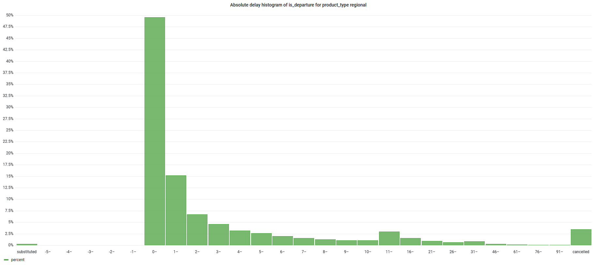

# HiveLine

HiveLine is a traffic simulation based on open data from European cities. It is a project for
the [Upper Challenge](https://labs.mobidatalab.eu/challenge-details/?id=123)
which is part of the [2023 Codagon](https://labs.mobidatalab.eu/living-lab-details/?id=90) hosted
by [MobiDataLab](https://mobidatalab.eu/).
The target was to find an objective way of calculating modal shares across European cities using open data.

Our solution integrates various datasets, for example [OSM](https://www.openstreetmap.org/)
data, [Eurostat](https://ec.europa.eu/eurostat/), etc.
to create a traffic simulation. Our current version is focussed on commuter modal shares, but can be extended to other
use cases as well. It is a data-driven agent-based simulation, which is able to simulate the movement of
individuals across a city.

## Methodology

### Hex grids

The first step of our simulation is to generate various hexagonal grids. We do this by using the population density
maps from [kontur.io](https://www.kontur.io/portfolio/population-dataset/), demographic data
from [Eurostat](https://ec.europa.eu/eurostat/)
and zoning data from [OSM](https://www.openstreetmap.org/). All data is converted to H3 hexagons.


### Virtual Commuter Generation

The next step is to create virtual commuters. A virtual commuter represents a single person that commutes from one
location to another. The virtual commuters are generated based on the hex grids. Each virtual commuter gets assigned
home and work locations (lon, lat), as well as modes of transport, employment type, etc. These attributes are selected
randomly and the probabilities are based on the hexagon data. For example, if a hexagon has a high population density,
the probability of a virtual commuter living in that hexagon is higher than in a hexagon with a low population density.

### Routing

After generating virtual commuters, we are generating routes for each of them. We are
using [OpenTripPlanner](https://docs.opentripplanner.org/en/v2.4.0/)
for this task. We use OSM datasets from [Geofabrik](https://download.geofabrik.de/) and GTFS datasets from
[TransitFeeds](https://transitfeeds.com/). We route based on the available modes of transport for each virtual
commuter. For example, if a virtual commuter has a car, we are routing using the car and a public transport profile.


### Modal Share Calculation

The last step is to calculate the modal share. Using the generated routes, we can approximate the choice of transport
mode for each virtual commuter. We can for example use the route that takes the least amount of time. We can then
calculate the transit modal share of motorized travel as

```python
transit_modal_share = transit_passenger_meters / motorized_passenger_meters
```


Note, that these numbers are an approximation based on many assumptions, that still need further testing.


## Extensions

### Public Transport Delays

We can extend the simulation to include public transport delays. We can use the [Public Transport Statistics](https://github.com/traines-source/public-transport-statistics)
dataset to simulate delays based on historical delay histograms. We can even incorporate this model into the routing 
step, so that if a virtual commuter can't catch a train due to a delay or cancellation, the route is recalculated.

Example of a delay histogram for German regional public transport:


### Congestion Simulation

Another feature of our simulation is that we can estimate congestion based on the routes each car virtual commuter
takes. The idea is to extract which parts of roads are used often by car routes. We can then use this information to
estimate congestion. This can be combined with the modal share calculation to get a more accurate model, as the decision 
we make in the modal share calculation part affects which routes are used by cars and the congestion simulation affects
delays and therefore the decisions. Iterating this loop a few times leads to a converging model.


