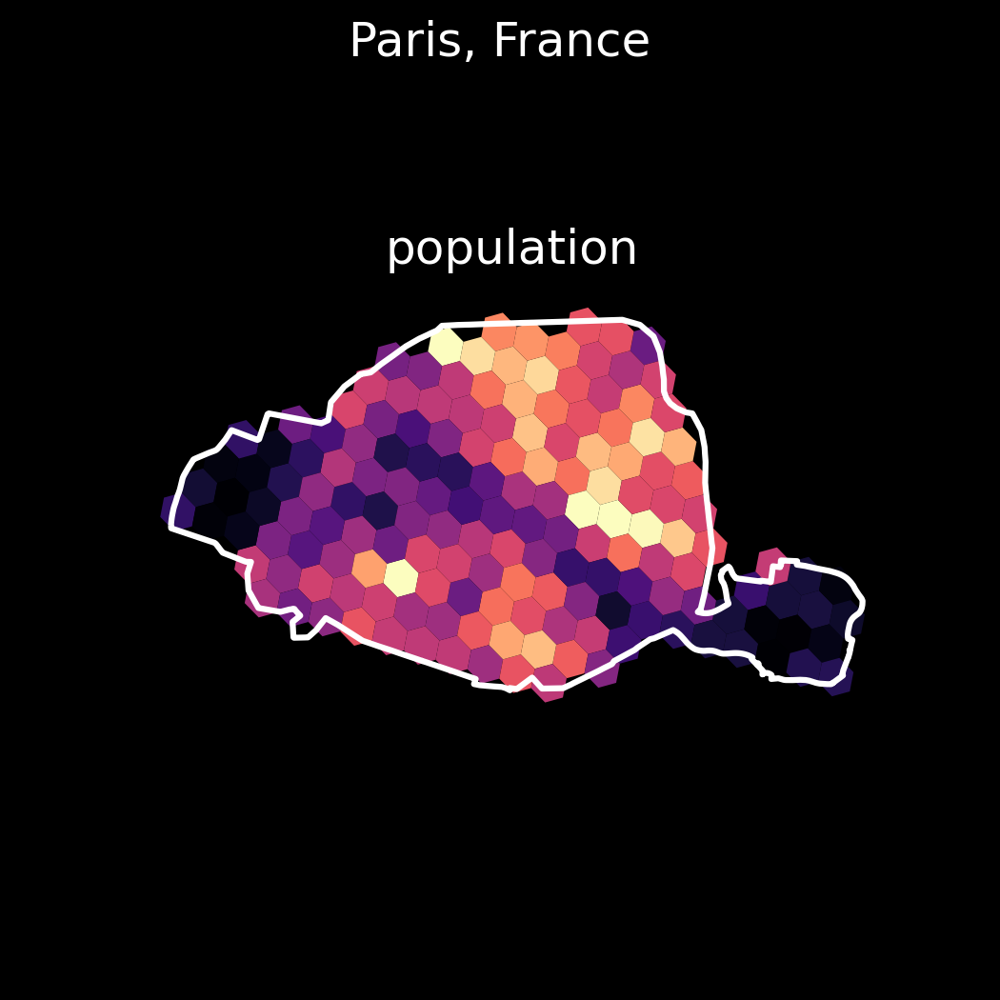
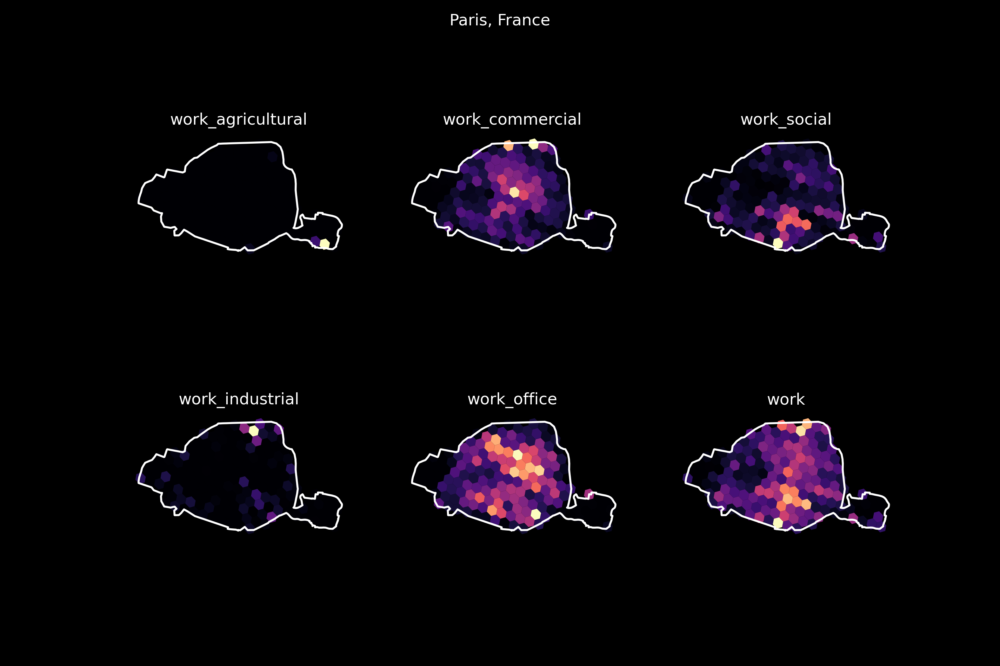

# Origin Destination 
Here are gathered and standardized the population, demographic and zoning data that can then be used to generate virtual commuters.

The Jupyter notebooks were used to test the implementations before making it a structured package, they can still be used to generate data ([`demographic_stats.ipynb`](../examples/demographic_stats.ipynb)), and  visualizations ([`zoning_visualization.ipynb`](../examples/zoning_visualization.ipynb)).  

## Package
The [`od`](../od/) package helps to process and generate:
- demographic data at a regional level 
- zoning data at hexagonal tile precision

## Optimizations
Some data can be long to process (zoning data for large area), and can be needed several times. That's why it is possible to **export** the generated data to mongodb.  

Moreover, the loading functions are **cached** with the database, that means that if the data is available, it is automatically loaded instead of recomputing it.  

Also, the processing of tiles data is made by **chunks** to cope the memory overflow for large areas.

## Usage
### Place  

The place name can be any city, metropolitan area, district, or other that has a name and is referenced in Open Street Map. The country precision is preferrable.
```python
from od.place import Place

# declare the place object
place_name = 'Paris, France' 
city = Place(place_name)

# load the data
city.load_all()

# export generated data to the database
city.export_place_to_mongo()
city.export_tiles_to_mongo()
```
The data can be accessed within `city.data`, which is a GeoDataFrame.  

Heatmaps can be produced for any zoning category. 
```python
city.plot_zoning(['population'], save_name='population')
```

A list of categories can be provided
```python
city.plot_zoning([i for i in city.data.columns if 'work' in i])
```


### Stats
Similarly, regional demographic statistics are accessible as follows:

```python
stats = Stats(city)
stats.load_all()
# show the DataFrame
stats.demographic
# export to database
stats.export_to_mongo()
```